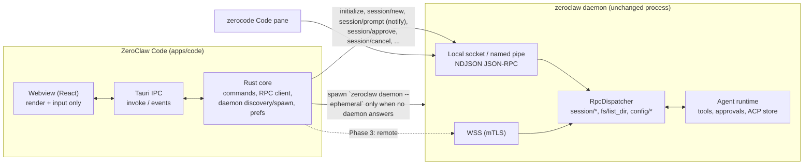

# Zero Claw-Code: design and delivery plan

> This document was written as an in-tree plan for the ZeroClaw repository,
> under the working name "ZeroClaw Code", against master `46479bdca7`. The
> maintainers chose not to take on another UI, so the app now lives here as
> Zero Claw-Code. Sections 7.1, 7.9, 10, and 11 describe in-tree mechanics
> (workspace membership, that repository's CI gates, install script, labels)
> that no longer apply. Sections 3 to 5 remain an accurate description of the
> daemon contract, and section 8 remains the list of daemon-side changes to
> propose upstream as ordinary RPC improvements. Product-name mentions below
> are historical.

Status: proposed design (FND-002 "Designs" family). Drafted with Claude; the
sponsoring maintainer owns accuracy and review response. Evidence snapshot: master
`46479bdca7`, 2026-09-10. Claims are tagged Verified (read in code at that commit),
Proposed (this plan's recommendation), or Unknown (not verified).

The phases and issue list are the input for an `RFC:` issue and an implementation
tracker; the accepted decision will be recorded as ADR-016. This page creates neither.

## 1. Recommendation, scope, non-goals

Recommendation (Proposed): build "ZeroClaw Code", a separate optional Tauri 2 desktop
application at `apps/code/`, as a thin presentation client of the daemon's existing
JSON-RPC session plane, the same plane zerocode's Code pane uses. The Rust core owns the
daemon connection, daemon discovery and spawn, and UI preferences; the webview owns
rendering and input. The daemon keeps agent execution, tools, approvals, and
authoritative session state. The app installs alongside `zeroclaw` without requiring it
to be running: it attaches to a running daemon when one answers and otherwise starts an
ephemeral one that exits when the app leaves.

First release scope (MVP): one workspace and one coding session per window, streaming
progress with tool cards, inline approvals (allow once, allow always, reject), cancel,
resume of persisted sessions, and a Changes panel with per-turn file edits. Phase 1 is a
developer build (`cargo tauri build`); installable release bundles arrive at the end of
Phase 2.

Non-goals: an IDE, an embedded editor, an integrated terminal, a multi-agent dashboard,
re-creating the web dashboard or zerocode's Config, Doctor, Logs, and SOP panes,
bypassing daemon approvals through desktop file-system access, mobile targets,
auto-update in the first release, and a sidecar-bundled kernel in the first release. The
last point deviates from FND-001's description of the desktop distribution ("bundles
runtime + gateway + UI"); `zeroclaw-desktop` keeps that role, and a bundled variant of
this app is a Phase 3 option.

## 2. Product intent and relationship to zerocode

Verified: zerocode's modes are Dashboard, Config, Doctor, Code, Chat, Logs, Quickstart,
and Sop (`apps/zerocode/src/app.rs`, `enum Mode`; `Mode::Acp` displays as "Code" through
the `zc-pane-code` string). The Code pane, `apps/zerocode/src/acp.rs`, delegates every
call to `chat::Chat::new(rpc, PaneKind::Acp)`; Code and Chat are the same widget. The
deltas: `session/new` with `chat_mode: "acp"`, `exclude_memory: true`,
`keep_siblings: true`, and `interaction_surface: "zerocode_code"`; sessions listed by
`session/list-acp` (a dedicated `acp-sessions.db`); a cwd plus git-branch footer; a cwd
picker only over WSS; runtime enrichment prefixes stripped from restored user messages.

Proposed positioning: ZeroClaw Code is the graphical form of that Code session. Both are
RPC-only clients of one daemon and share persisted ACP sessions, so a session started in
zerocode can be resumed in ZeroClaw Code and back. The "Code" name matches zerocode's
tab on purpose; zerocode's sidebar tag for the same pane reads "ACP"
(`zc-chat-pane-acp`), which a follow-up should align.

## 3. How the Code pane works today (Verified trace)

Transport: `$ZEROCLAW_SOCKET`, else `<config_dir>/data/daemon.sock` (Windows:
`\\.\pipe\zeroclaw-<hash of data dir>`); config dir from `--config-dir`,
`$ZEROCLAW_CONFIG_DIR`, then `~/.zeroclaw` (`apps/zerocode/src/client.rs`,
`resolve_socket_path`, `resolve_config_dir`). Newline-delimited JSON-RPC 2.0 with an
8 MiB frame cap (`crates/zeroclaw-runtime/src/rpc/local.rs`). Remote is mutual-TLS WSS
only, with a separate enrollment listener and certs under `<config_dir>/tls`
(`apps/zerocode/src/enroll.rs`, `crates/zeroclaw-runtime/src/rpc/wss.rs`).

Handshake: `initialize` must come first (`AUTH_REQUIRED -32010` otherwise, also on a
bad `tui_sig`). Params: `protocol_version` (default 1), optional `tui_id` and `tui_sig`
(reconnect identity), `env` (forwarded to agent subprocesses and looked up by the
`tui_id` passed on `session/new`), and `clientCapabilities` (only `elicitation` is read).
Result: `protocol_version` (1), `server_version`, `server_pid`, `tui_id`, `tui_sig`,
`capabilities` (every method name in `Method::ALL`), and `commands`. The only version
check the daemon performs is `protocol_version` (`VERSION_MISMATCH -32011`); it never
compares the client's package version (`crates/zeroclaw-runtime/src/rpc/dispatch.rs`,
`handle_initialize`). zerocode's refusal when `server_version` differs from its own
package version is client policy (`client.rs`, `parse_initialize_response`).

Session lifecycle: `session/new` creates a fresh id or resumes by `session_id`; `cwd`
precedence is the caller's value, then the persisted `workspace_dir`, then the agent
workspace dir; a resume without an `interaction_surface` inherits the stored one and a
different one is rejected. `session/prompt` is sent as a notification (the handler is
always spawned; the response exists for legacy request-form callers). Progress streams
as `session/update` notifications, and `turn_complete` is the sole authority for turn
end (outcome `completed`, `cancelled`, or `failed`, echoing `client_turn_generation`),
emitted on every exit including cancel and session-not-found. Event types:
`agent_message_chunk`, `agent_thought_chunk`, `tool_call`, `tool_result`,
`approval_request`, `context_usage`, `plan`, `history_trimmed`, `turn_complete`
(`rpc/types.rs`, `SessionUpdateEvent`). The public page
[RPC socket transport](./rpc-socket.md) lists an older, shorter set.

Approvals: `approval_request {request_id, tool_name, arguments_summary, timeout_secs}`;
default timeout 120 s, after which the runtime denies by policy and tells the model that
no operator decision was available. `session/approve` decisions: `allow_once`,
`allow_always`, `reject` (alias `reject_once`), and `reject_with_edit` with
`replacement`. `allow_always` is recorded in memory on the session agent's approval
manager; it is not persisted and does not survive a daemon restart.

Cancellation: `session/cancel` requires the caller to own the session
(`SESSION_NOT_OWNED -32003`), fires the cancellation token, allows a 5 s cooperative
grace, then aborts; tool subprocesses are killed on drop; `turn_complete` with outcome
`cancelled` is always emitted. `session/close` removes the live session (durable rows
untouched), `session/kill` tombstones the ACP row, and `session/delete` deletes chat rows
only. None of the three checks ownership, and all of them cancel an in-flight turn.

Persistence: chat sessions live in the `SessionBackend`
(`<data_dir>/sessions/sessions.db`), ACP sessions in `AcpSessionStore`
(`<data_dir>/sessions/acp-sessions.db`) with structured tool-call history,
`workspace_dir`, `interaction_surface`, `plan_json`, `killed_at`, and `last_activity`.
The ACP transcript is persisted at turn end. `session/messages` returns structured
`message`, `tool_call`, and `tool_result` entries for ACP sessions; the plan is replayed
as a `plan` update on resume. `session/state` reports `running` while the turn holds
the session permit, which is released only after persistence, so `idle` implies the
transcript is written.

Reconnect (zerocode): one attempt per second; re-`initialize` with the cached `tui_id`
and `tui_sig`; rebuild panes; `session/new` with the old id and no cwd; then
`session/messages`; stale approvals rejected and elicitations cancelled; a stuck turn is
recovered with `session/cancel`, polling `session/state` until idle, then
`session/messages`.

Daemon autostart (zerocode): when the initial local connect fails with a non-terminal
error it spawns `<dir of exe>/zeroclaw daemon --ephemeral --config-dir <dir>` with
`ZEROCLAW_SOCKET` set, detaches on success, never kills it, and permits one respawn per
disconnected episode. The existing desktop app spawns `zeroclaw daemon -p 42617`
detached and drops the child handle (`apps/tauri/src/daemon.rs`), so a daemon that exits
early stays a zombie until the app exits.

## 4. Capability inventory

Disposition: Preserve (MVP), Simplify (MVP, reduced), Defer (Phase 2 or 3), Exclude.
"Daemon interface" says whether an existing RPC exposes it. All rows are Verified.

| Capability | Source in zerocode | Daemon interface | Disposition |
|---|---|---|---|
| Send prompt | `chat.rs` `InputBarAction::Submit` then `spawn_prompt_on` | `session/prompt` (notification form) | Preserve |
| Queue prompts while a turn runs (cap 32) | `ChatState::message_queue` | none (a second `session/prompt` waits up to 30 s then `SESSION_BUSY -32002`) | Defer (Phase 2) |
| Send now / inject (cancel then prompt) | `inject_message` | `session/cancel` + `session/prompt` | Defer (Phase 2) |
| Cancel / interrupt | `Ctrl+C`, `Esc`, `primary+d` | `session/cancel` (ownership-checked) | Preserve |
| Approve once / always / reject | approval keys | `session/approve` | Preserve |
| Reject with edit (`$EDITOR`) | `reject_with_edit` for `file_edit` and `file_write` | `session/approve` + `replacement` | Defer (Phase 2, in-app editor) |
| Approval countdown | `timeout_secs` | event field | Preserve |
| New session / resume / switch | `restart_session_for_state`, `switch_to_session_entry` | `session/new`, `session/list-acp`, `session/messages` | Preserve (one session per window; rail in Phase 2) |
| Close session | sidebar close control | `session/close` | Preserve |
| Kill session | Dashboard only | `session/kill` | Defer (Phase 2) |
| Delete session | unbound action | `session/delete` (chat rows only) | Defer (D8) |
| Model / provider picker, temperature | `open_model_picker`, `apply_session_override` | `config/catalog-models`, `session/configure` (`model`, `model_provider`, `temperature`) | Defer (Phase 2) |
| Effort / thinking per session | none | none (global `[runtime].reasoning_effort` via `config/set`) | Defer (D12) |
| Agent picker | `open_agent_picker` | `agents/list` (alias, enabled, channels), `agents/status` | Preserve (enabled agents only; auto-select when one) |
| Workspace (cwd) choice | `ChatPhase::PickCwd` (WSS only) | `session/new.cwd`; `fs/list_dir` | Preserve (OS folder dialog; remote browser in Phase 2) |
| cwd + git branch chip | ACP footer | `session/new.workspace_dir`, `session/git_branch` | Preserve |
| Attachments | `/attach`, clipboard, explorer | inline `attachments[]` on `session/prompt` (path locally, `data_b64` over WSS; 10 MiB per file, 20 MiB per request) | Defer (Phase 2) |
| File explorer | `file_explorer.rs` | `fs/list_dir` (unscoped, follows symlinks) | Simplify (folder picker only) |
| Diff rendering | `render_tool_entry` + `diff.rs` (local diff of `file_edit` input; reads local disk for line numbers) | none; derived from `tool_call.raw_input` | Preserve as a client-side diff without local reads; working tree via D6 |
| Tool / shell output cards | `render_tool_entry` | `tool_call`, `tool_result` (`artifact` dropped) | Preserve |
| Todo / plan tracker | `todo_tracker.rs` | `plan` update, `session/state.plan` | Simplify (collapsible strip) |
| Agent sidebar, multi-session panes | `agent_sidebar.rs` | `session/list-acp`, `keep_siblings` | Defer (Phase 2) |
| Turn status | `turn_status.rs` | derived | Preserve |
| Context usage bar | `CtxBar` | `context_usage` (input tokens and budget only) | Preserve |
| Cost display | Dashboard only | `cost/query`, `cost/org` | Exclude from MVP |
| Elicitation forms | `try_install_elicitation` | daemon-to-client `elicitation/create` | Defer (Phase 2) |
| Slash commands | `SlashCommandRegistry` + `initialize.commands` | `initialize.commands` | Simplify (palette) |
| Thinking toggle | local `show_thoughts` | none | Preserve |
| Reload daemon config | `GlobalAction::ReloadDaemon` | `config/reload` | Defer (Phase 3) |
| Session health resync | `cancel_confirm_and_reload` | `session/cancel`, `session/state`, `session/messages` | Preserve (reconnect) |
| Logs, Doctor, Config editor, SOP, Quickstart, Dashboard | other panes | various | Exclude |
| Keybinding presets / chord capture | `zerocode_pane.rs`, `keymap/` | none | Simplify (fixed shortcuts + palette; rebinding in Phase 3) |
| Themes | `theme.rs` | none | Simplify (light, dark, system) |
| Remote daemon (WSS + enrollment) | `enroll.rs`, `client_crypto.rs`, `relay_proto.rs` | WSS and enroll listeners, `cert/renew` | Defer (Phase 3) |

## 5. Daemon facts that shape the design, and the gaps

Verified facts with direct consequences:

- Ownership is per connection (`RpcSession.owner_tui_id`, stamped at `session/new`);
  only `session/cancel` enforces it; a resume rebinds ownership to the caller. A second
  client resuming a session that another client is running silently takes cancel
  ownership; nothing in `session/list-acp` says a session is live.
- On disconnect the daemon only unregisters the TUI identity; sessions persist and turns
  continue, but their notifications (including `turn_complete` and later
  `approval_request` events) go to the connection captured at prompt time; the approval
  channel rebind on resume waits on the agent mutex for the rest of the turn. Approvals
  raised while a client is disconnected are therefore denied after 120 s.
- Pending approvals live in a daemon-wide map keyed by `request_id`; there is no way to
  list them; `session/approve` performs no session or ownership correlation and returns
  `acknowledged: true` even when nothing resolved.
- `session/list-acp` rows have no `workspace_dir` and always `name: None`; nothing on
  the RPC plane renames or deletes an ACP session.
- No RPC reads a file, lists changed files, or diffs a working tree. `fs/list_dir` has no
  session scoping (a `..` guard only; symlinks followed) despite a header comment
  restricting it to WSS; `file/attach` path mode accepts any absolute path locally.
- `session/configure` knobs are exactly `model`, `model_provider`, and `temperature`.
- `tools/list` is not an RPC; `tools/param-options` with domain `tool_names` is the
  nearest.
- `zeroclaw gateway start` does not start the RPC socket; `zeroclaw daemon` always does.
  `--ephemeral` changes only the exit rule: the daemon still starts the gateway,
  configured channels, cron, and the control plane; its client count is shared across
  socket, WSS, relay, and enroll listeners, and it exits 1 to 2 s after the last client
  of any transport leaves. There is no `--no-gateway` or `--no-channels` flag.
- The dispatcher processes a connection's frames serially; only `session/prompt` is
  spawned; `session/close` waits on the session permit (up to 30 s) and a fresh
  `session/new` builds the agent inline.
- Windows named-pipe names are derived on both sides by hashing the data dir with
  `DefaultHasher`, whose algorithm the standard library does not fix across releases;
  clients built with a different toolchain could disagree with the daemon.

Gap table:

| Gap | Status | Plan |
|---|---|---|
| RPC-only daemon spawn (no gateway, channels, cron) | absent | D1 (Phase 1) |
| Workspace dir, live state, owner in session listing | absent | D2 (Phase 1) |
| Notifications and approvals follow the current owner after a reconnect | absent | D3 (Phase 2, no wire change) |
| Pending approval discovery | absent | D4 (Phase 2) |
| Approval authorization vs session | absent | D5 (Phase 2, security) |
| Working-tree diff / changed files | absent | D6 (Phase 2) |
| Bounded file read; workspace confinement of listing and attach | absent, listing unscoped | D7 (Phase 2, security) |
| ACP session rename / delete | absent | D8 (Phase 2) |
| Stable named-pipe derivation | unstable hash | D9 (Phase 2, Windows) |
| Replay of an in-flight turn's earlier events | absent | D10 (Phase 3, align with RFC #10526) |
| Mid-turn steering on the RPC path | agent supports it; RPC passes `None` | D11 (Phase 3); client-side send-now meanwhile |
| Per-session effort / thinking | absent | D12 (Phase 3, RFC-adjacent) |
| Protocol negotiation beyond `protocol_version == 1` | method list only | policy in section 7.3; no daemon change |
| Interaction surface for a desktop client | closed enum; mismatch rejected | omit the field (assumption 11); optional prose refactor D0 |

## 6. Product design

### 6.1 Default experience (Proposed)

One window, three regions; everything else behind the palette or a chip popover:

1. Conversation (center, always visible): streamed assistant text (Markdown, code
   blocks with copy), collapsed tool cards (name plus one-line summary; expand for
   input and output), a collapsed plan strip, an inline approval card with a live
   countdown that is also pinned as a banner while pending, and the composer.
2. Session rail (left, collapsible, hidden on narrow windows): sessions grouped by
   workspace (D2) with a live marker, "New session", agent switcher.
3. Changes panel (right, toggle): files touched in this session grouped per turn, each
   with a unified diff derived from `file_edit` (old and new strings) and `file_write`
   (full content, capped with "show more"); no line numbers until D7 provides file
   reads; Phase 2 adds working-tree status from D6.

A status bar shows connection state (socket path or remote host, and whether this app
started the daemon), daemon version, turn status, context usage, cwd, and git branch.

Priority order for what is visible by default: (1) conversation and composer,
(2) progress and approvals, (3) changes, (4) session switching, (5) model chip,
(6) workspace and repository navigation (chip and picker), (7) command output inside
tool cards, (8) interruption and recovery banners only when needed.

### 6.2 The MVP workflow

Open the app, get a daemon attached or started, choose a folder (OS dialog) and an
enabled agent (auto-selected when there is one), type a task, watch streaming progress
and tool cards, answer approvals inline, inspect Changes, cancel if needed, then close
or resume later (a resumed session shows history up to the last completed turn).

### 6.3 Annotated wireframe (Proposed)

```text
+------------------------------------------------------------------------------+
| [=] ZeroClaw Code    myrepo  (main a1b2c3d)         [Changes 3]  [cmd-K]  [?] |  title row: rail toggle, cwd chip
+----------+---------------------------------------------+---------------------+  (click: pick folder), branch,
| Sessions |  You: Add retry to the fetch helper          | Changes (this turn) |  Changes toggle, palette, help
|  * fix.. |                                              |  src/fetch.ts  +12-3|
|    add.. |  Agent: I'll look at fetch.ts first.         |  src/fetch.test.ts  |  diff list grouped per turn;
|          |  > read_file src/fetch.ts        [collapsed] |  ------------------ |  click a file for the diff
|  + New   |  > file_edit  src/fetch.ts  +12 -3  [open]   |  -  const r = ...   |
|          |                                              |  +  for (let i ...  |
|  agent:  |  [!] Approve `shell`: npm test  (0:58)       |                     |
|  coder v |      [Allow once] [Always] [Reject]          |                     |
|          |  ...streaming text...                        |                     |
|          |  [plan: 2/4 done  v]                          |                     |
|          +----------------------------------------------+                     |
|          | Ask for a change...                          |                     |
|          | [attach] [model: claude-x v] [thoughts: off] |   Send (Enter)      |
+----------+----------------------------------------------+---------------------+
| local ~/.zeroclaw/data/daemon.sock (started by app)  v0.8.5  working  ctx 31k/200k |  status bar
+------------------------------------------------------------------------------+
```

Progressive disclosure: chips open popovers (model, provider, temperature; cwd; agent);
the palette (Cmd/Ctrl+K) lists every action with its shortcut (new session, switch,
close, cancel, toggle thoughts, toggle plan, stop the daemon this app started, reload
daemon config, open log location); rail and Changes state is remembered per window.

### 6.4 States

- No daemon: "Looking for a daemon at <endpoint>", then "Starting a ZeroClaw daemon
  (gateway, channels and cron included until an RPC-only mode exists)" or "ZeroClaw is
  not installed" with "Locate zeroclaw" and install instructions; a 10 s `initialize`
  timeout, never a silent hang.
- Connected, no session: folder and agent chooser, recent sessions (with workspace and
  live markers once D2 lands). Zero enabled agents: "No enabled agents; run
  `zeroclaw onboard`" (a `session/new` for a bad alias returns an internal error
  "Failed to create agent", mapped to this state).
- Resume of a live session: "In use by another client" confirmation before
  `session/new` takes ownership (checked with `session/state`).
- Loading: skeleton transcript while `session/messages` replays.
- Disconnected: banner with reconnect countdown; composer disabled; draft kept.
- Reconnected while a turn was running: banner "A turn was running while disconnected;
  approvals raised meanwhile are denied after 120 s" with Stop (default:
  `session/cancel`, reload) or Wait (poll `session/state` until idle, then reload).
- Closing the last window while a turn runs on an app-started daemon: dialog with
  "Stop the turn and quit", "Finish the turn, then quit" (window hides, the process
  stays until `turn_complete`, then exits), or "Cancel". On an independently running
  daemon the turn continues and a notice says so.
- Protocol mismatch or version below the floor: blocking dialog naming both versions.
- RPC errors (`SESSION_BUSY`, `SESSION_NOT_FOUND`, `SESSION_LIMIT_REACHED`,
  `SESSION_NOT_OWNED`): plain-language toasts with the next action.

### 6.5 Keyboard and accessibility (Proposed)

Shortcuts mirror zerocode where sensible: Enter send, Shift+Enter newline,
Cmd/Ctrl+Enter send now (Phase 2), Esc cancel turn (outside modals), Cmd/Ctrl+N new
session, Cmd/Ctrl+K palette, Cmd/Ctrl+B rail, Cmd/Ctrl+J Changes, approval keys Enter,
A, and R when the approval card is focused, `t` thoughts toggle in transcript focus;
every action is also in the palette. ARIA: transcript as `role=log` with
`aria-live=polite`, approvals as `role=alertdialog`, tool cards as disclosure buttons,
focus trapped in modals, visible focus rings, reduced motion honored, 4.5:1 contrast in
both themes, no information by color alone.

## 7. Architecture

### 7.1 Location and layout (Proposed)

```text
apps/code/
  Cargo.toml                 # crate `zeroclaw-code` (workspace member), bin `zeroclaw-code`
  tauri.conf.json            # frontendDist: "ui/dist"; product "ZeroClaw Code"; id ai.zeroclawlabs.code
  capabilities/default.json  # core:default + the few plugin permissions used; no `remote`
  build.rs, icons/, Info.plist, windows/app.manifest
  src/main.rs, lib.rs
  src/daemon/{discovery.rs, spawn.rs}   # endpoint + config-dir resolution; ephemeral spawn
  src/rpc/{client.rs, wire.rs}          # NDJSON JSON-RPC client, mirrors, identity, reconnect
  src/commands/*.rs                     # Tauri commands (the only IPC surface)
  src/events.rs, src/state.rs, src/prefs.rs
  tests/capability_security.rs          # copied from apps/tauri; run in CI
  ui/                                   # Vite + React + TS; package.json, src/, dist/ (ignored)
```

The layout mirrors `apps/tauri` on purpose: the generated `install.sh` discovers apps
from `apps/*/Cargo.toml` and detects Tauri apps by `tauri.conf.json` at the app root.
Like `zeroclaw-desktop`, the crate is excluded from the workspace-wide clippy, doc,
check, and nextest jobs (it needs platform webview toolchains) and is checked by its own
workflow.

### 7.2 Diagram



### 7.3 Frontend to Rust to daemon (Proposed)

- The webview calls typed commands (`connect`, `sessions_list`, `session_open`,
  `session_prompt`, `session_cancel`, `session_approve`, `session_configure`,
  `models_catalog`, `agents_list`, `git_branch`, `fs_list_dir`, `pick_folder`,
  `elicitation_respond`, `daemon_stop_owned`, `prefs_get`, `prefs_set`) and listens to
  events (`code://connection`, `code://session-update`, `code://inbound-request`).
- The Rust core keeps one `DaemonClient` per endpoint: NDJSON framing,
  request/response correlation, notification broadcast, inbound request routing
  (`elicitation/create`; unknown inbound requests answered with `-32601` so the daemon's
  outbound request fails fast), a 10 s `initialize` timeout, reconnect with the cached
  `tui_id` and `tui_sig` and a 1 s throttle, per-call timeouts, and `tui_id` on every
  `session/new` (required for env forwarding). It is modeled on
  `apps/zerocode/src/client.rs` (`RpcClient::connect`, `route_inbound_frame`,
  `parse_session_update`) and the mirrors in `apps/zerocode/src/wire.rs`, but ships its
  own bounded copy (assumption 3), with parser tests fed by serde fixtures that a
  `zeroclaw-runtime` test emits for `InitializeResult`, every `SessionUpdateEvent`
  variant, `SessionEntry`, and `MessageEntry`.
- Serial-dispatch constraint (assumption 7): the core cancels and waits for
  `turn_complete` before `session/close` or `session/delete` on a running session and
  may open a second control connection for list, catalog, and config calls.
- Wire policy (assumption 5): block on a `protocol_version` mismatch or a
  `server_version` below the app's declared floor; feature-detect methods from
  `capabilities` (which proves a method exists, not that it is available: for example
  `session/list-acp` fails when the ACP store is absent); ignore unknown
  `session/update` types; surface `server_version` in the status bar.

### 7.4 Workspace ownership and file access (Proposed)

The daemon owns the workspace. The app never reads or writes repository files by
daemon-supplied paths (zerocode's local-disk read for diff line numbers is the
anti-pattern; it is wrong over WSS). Local folder selection uses the OS dialog and
passes the absolute path as `session/new.cwd`. Attachments (Phase 2) pass paths locally
and `data_b64` remotely as the daemon requires. File preview waits for D7. Remote
(Phase 3) reuses zerocode's mTLS enrollment identity and cert files.

### 7.5 Daemon lifecycle (Proposed; mechanisms Verified)

1. Resolve config dir and endpoint like zerocode; honor `--config-dir`,
   `ZEROCLAW_CONFIG_DIR`, `ZEROCLAW_SOCKET`, `ZEROCLAW_DATA_DIR`. Windows: retry
   `ERROR_PIPE_BUSY` (231) as zerocode does (50 tries, 20 ms apart).
2. Try `initialize` (10 s). Success: attached to an independently running daemon; the
   app never signals it.
3. Failure that is not a version or auth error: locate `zeroclaw` (sibling of the
   executable, PATH, `~/.cargo/bin`, `~/.local/bin`, Homebrew and system dirs, as in
   `apps/tauri/src/daemon.rs`), spawn `zeroclaw daemon --ephemeral --config-dir <dir>`
   (plus `--rpc-only` once D1 exists) with `ZEROCLAW_SOCKET` set explicitly, detached
   (`process_group(0)`; Windows `DETACHED_PROCESS`, `CREATE_NEW_PROCESS_GROUP`,
   `CREATE_NO_WINDOW`), stdio to a bounded log under the app data dir; wait for
   readiness; record `server_pid` and mark the daemon as app-started. The child handle is
   dropped (never reaped, never signalled on exit).
4. What the user must know: until D1, an ephemeral daemon also starts the gateway,
   channels, and cron from the user's config; another client (zerocode, WSS) attaching
   later keeps it alive; it exits 1 to 2 s after the last client of any transport leaves;
   a later `zeroclaw daemon` started by hand collides on the socket lock and gateway
   port, which is why the palette offers "Stop the daemon this app started" (signal only
   a PID this app recorded, only on explicit action).
5. Closing the last window disconnects and the app exits (no tray). The section 6.4
   mid-turn dialog protects unfinished turns on app-started daemons; the ACP transcript
   is persisted only at turn end.

### 7.6 Streaming, reconnects, cancellation, approval recovery, compatibility

- Streaming: events are forwarded per session; the frontend coalesces chunks and
  virtualizes long transcripts.
- Reconnect: re-`initialize` with the cached identity; `session/new` resume without cwd
  for every open session; `session/state`; then the Stop/Wait banner. Until D3, events
  of an in-flight turn keep going to the dead connection; after D3, post-resume events,
  `turn_complete`, and new approval requests reach the live connection, and the client
  reloads the gap with `session/messages` on `turn_complete` (emitted after persistence).
- Cancellation: `session/cancel` after ownership is restored by the resume; the UI
  enters Cancelling and settles only on `turn_complete` (15 s watchdog).
- Approvals: the app remembers pending `request_id` values with deadlines and can still
  answer them after a reconnect within the window; discovery of approvals raised while
  disconnected needs D4.
- Compatibility: daemon changes are additive under protocol version 1 (new methods
  discoverable through `capabilities`, new fields with `#[serde(default)]`).

### 7.7 Windows and instances (Proposed)

`tauri-plugin-single-instance` keeps one process per user session; a second launch
focuses or opens a window. Each window shows one session; all windows share one
connection per endpoint (assumption 7). Profiles (other config dirs) come in Phase 3.

### 7.8 Credentials, untrusted content, least privilege (Proposed)

- Local mode stores no credentials; access is the daemon socket's 0600/0700 permissions.
  Remote mode keeps the client key under the config dir, in the Rust core only; the
  gateway pairing token is never used.
- Tauri ACL (Verified for Tauri 2.11.5 as used by `apps/tauri`): app-defined commands
  are allowed for local bundled content unless the app opts into an ACL manifest, and
  remote origins are blocked; `apps/tauri` relies on this with a capability granting
  only `core:default`. ZeroClaw Code does the same: `core:default` plus
  `dialog:allow-open` (folder and file pickers) and, if links open externally,
  `opener` restricted to http(s) with confirmation; no `fs`, `shell`, or `http`
  plugins; no `remote` block. The copied `capability_security.rs` allowlist admits
  exactly those permission ids and runs in CI. CSP: `default-src 'self'; connect-src
  ipc: http://ipc.localhost; img-src 'self' data:; style-src 'self' 'unsafe-inline'`
  (no loopback origins, unlike `apps/tauri`).
- Untrusted repository content (transcript text, tool output, file names, diffs) is
  rendered as text or sanitized Markdown (no raw HTML), never interpreted as
  instructions; paths are display-only.
- Approvals are always decided by the daemon; the app has no path to run a tool or
  change policy outside `session/approve`.

### 7.9 Packaging, installation, updates, CI (Proposed)

- Dev: `cargo tauri dev` from `apps/code`; `dev/run-code-dev.sh` mirrors
  `dev/run-tauri-dev.sh`.
- CI: a `code-app-check.yml` (or a matrix entry in `desktop-check.yml`) that builds the
  frontend (`npm ci`, typecheck, tests, build) and runs
  `cargo clippy -p zeroclaw-code --all-targets -- -D warnings` and
  `cargo test -p zeroclaw-code` on macOS, Linux, and Windows for `apps/code/**` changes.
  The RPC-boundary gate script gains a manifest argument and runs for both apps. A root
  architecture test (`tests/architecture/`) asserts that the `zeroclaw` package's
  resolved graph has no `tauri*`, `wry`, or `tao`, and that every file naming
  `--exclude zeroclaw-desktop` also names `zeroclaw-code`.
- Release (end of Phase 2): `build-code-*` jobs in `release-stable-manual.yml` with
  `continue-on-error: true` (the documented promotion path), artifacts
  `ZeroClawCode-<platform>` as dmg, AppImage, deb, and msi, macOS notarization with the
  existing secrets, the xtask spec test's pinned `tauri-cli` count updated, and a
  `tests/architecture/code_release.rs` guard.
- Installation: release bundles are the supported path. `install.sh` discovers the app
  automatically, keeps Tauri apps out of `--full`, and installs it only with
  `--apps zeroclaw-code`; the generated zones are regenerated with
  `cargo generate installers` and the spec app-policy lists updated. Labeler: new path
  label for `apps/code/**` documented in `maintainers/labels.md`.
- Updates: none in the first release (the app shows a notice on version skew). Phase 3
  evaluates `tauri-plugin-updater` with signed manifests on GitHub Releases, gated on
  signing-key availability.

### 7.10 Proposed budgets (not measured)

| Metric | Budget |
|---|---|
| Cold start to interactive, daemon already running | p50 at most 1.5 s, p95 at most 3 s |
| Cold start including ephemeral daemon spawn | daemon readiness + 0.5 s |
| Resident memory, one session, 1k transcript entries | at most 150 MB (webview included) |
| Resident memory, five sessions, 10k entries | at most 300 MB |
| Installer size (no sidecar kernel) | at most 15 MB macOS dmg; frontend at most 600 KB gzipped |
| Keypress to composer render | at most 16 ms |
| Stream chunk to paint | p95 at most 50 ms |
| Approval event to visible card | at most 100 ms |
| Cancel click to Cancelling state | at most 100 ms; `turn_complete` within the daemon's 5 s grace |
| Transcript scroll with 5k entries | 60 fps with virtualization |

## 8. Backend changes (explicit)

All additive under protocol version 1; each is its own PR with `rpc` (or `daemon`)
scope. Risk labels follow [How to contribute](../contributing/how-to.md): trust,
credential, compatibility, or security boundaries are `risk:high`.

| Id | Change | Files (likely) | Phase | Risk |
|---|---|---|---|---|
| D0 (optional) | Strings-only refactor: make the interaction-surface prompt prose client-neutral ("ZeroCode Code (ACP)", "current ZeroCode transcript") | `crates/zeroclaw-runtime/src/agent/prompt.rs`, locales | 1 | low |
| D1 | `zeroclaw daemon --rpc-only` (or `--no-gateway --no-channels`): register only the local socket (and WSS when enabled) so ephemeral spawns from zerocode and the app do not start the gateway, channels, or cron | `src/main.rs` (daemon args and registration), `crates/zeroclaw-runtime/src/daemon/mod.rs`, docs `architecture/rpc-socket.md` | 1 | medium |
| D2 | `session/list-acp` rows add `workspace_dir`, `interaction_surface`, `state` (`running` or `idle`), and an `owned` marker | `rpc/dispatch.rs` (`handle_session_list_acp`), `rpc/types.rs` (`SessionEntry`), `crates/zeroclaw-infra/src/acp_session_store.rs` (the summary already has `workspace_dir`) | 1 | low |
| D3 | Current-owner routing: give `RpcSession` a swappable outbound slot set at `session/new` and swapped in `resume_existing`; route the prompt closure's notifications, `emit_turn_complete`, and `RpcApprovalChannel` through it at send time (no wire change; zerocode benefits) | `rpc/session.rs` (`resume_existing`), `rpc/dispatch.rs` (prompt closure, `emit_turn_complete`, `rebind_rpc_approval_channel`), `rpc/approval_channel.rs` | 2 | medium |
| D4 | `session/state` includes `pending_approval {request_id, tool_name, arguments_summary, deadline}` | `rpc/context.rs` (`ApprovalPendingMap` metadata), `rpc/approval_channel.rs`, `rpc/dispatch.rs`, `rpc/types.rs` | 2 | medium |
| D5 | `session/approve` requires `request_id` to belong to `session_id` and the caller to own the session (same rule as `session/cancel`); `acknowledged: false` when nothing resolved | `rpc/dispatch.rs` (`handle_session_approve`), `rpc/context.rs` | 2 | high, `domain:security` |
| D6 | `git/status` and `git/diff {session_id, path?, max_bytes?}` scoped to the session's `workspace_dir`, bounded output, no shell interpolation | new `rpc/git_diff.rs` or extend `rpc/git.rs`, `rpc/dispatch.rs`, `rpc/types.rs`, `crates/zeroclaw-api/src/jsonrpc.rs` | 2 | medium |
| D7 | `fs/read {session_id, path, max_bytes}` bounded and confined to the workspace; confine `fs/list_dir` and `file/attach` path mode to the session workspace (no symlink escape) | `rpc/fs.rs`, `rpc/attachments.rs`, `rpc/dispatch.rs` | 2 | high |
| D8 | ACP session `name` column and `session/rename`; `session/delete` also deletes the ACP row | `acp_session_store.rs` (migration), `rpc/dispatch.rs`, `rpc/types.rs` | 2 | medium |
| D9 | Stable, documented named-pipe name derivation (or a `<data_dir>/daemon.endpoint` file), applied to the daemon and zerocode in one PR | `rpc/local.rs`, `apps/zerocode/src/client.rs`, docs `architecture/rpc-socket.md` | 2 | medium |
| D10 | Per-session event fan-out with a bounded replay buffer and `session/subscribe {session_id, since_seq}` | `rpc/dispatch.rs`, `rpc/session.rs`, `rpc/turn.rs` | 3 | high (align with RFC #10526) |
| D11 | Mid-turn steering on the RPC path (`session/steer`) using the agent's steering channel | `rpc/turn.rs` (`execute_turn`), `rpc/dispatch.rs` | 3 | medium |
| D12 | Per-session reasoning effort and thinking on `session/configure` | `rpc/session.rs` (`SessionOverrides`), `rpc/dispatch.rs`, provider plumbing | 3 | high (RFC-adjacent; relates to RFC #7100) |
| D13 | Forward `output_tokens` and `cost_usd` on `context_usage` | `rpc/dispatch.rs` mapping | 3 | low |

Related open RFCs to reconcile with before D3, D10, and the attachment work:
[#9487 runtime-owned sessions](https://github.com/zeroclaw-labs/zeroclaw/issues/9487),
[#10526 append-only session events](https://github.com/zeroclaw-labs/zeroclaw/issues/10526),
[#9488 unified files and attachments](https://github.com/zeroclaw-labs/zeroclaw/issues/9488),
[#7100 per-model capability config](https://github.com/zeroclaw-labs/zeroclaw/issues/7100),
and the accepted compatibility precedent
[#9975 web bundle and daemon compatibility](https://github.com/zeroclaw-labs/zeroclaw/issues/9975).

## 9. Phases

Phase 1, working vertical slice (developer builds): scaffold and gates, Rust RPC core,
daemon discovery and spawn, single-session flow (new, resume, prompt, stream, approvals,
cancel, basic reconnect), composer and transcript, Changes panel v1, D1, D2. Exit
criterion: a task typed in the app runs against an independently started daemon and an
app-started ephemeral daemon, with approvals and cancel working, on macOS, Linux, and
Windows dev builds.

Phase 2, essential coding parity, shipped as installable bundles: workspace picker
(local plus remote browsing), attachments, model and provider picker, reject-with-edit,
elicitation forms, client-side queue and send-now, full reconnect recovery, session rail
and windows, session management (kill, delete, rename), working-tree Changes (D6), file
preview (D7), D3, D4, D5, D8, D9, release and packaging jobs.

Phase 3, refinement: replay (D10), steering (D11), remote daemon with enrollment,
updater evaluation, localization (the five zerocode locales), accessibility audit,
performance measurement against the budgets, shared RPC client crate extraction, D12,
D13.

## 10. Ordered issue breakdown

Conventions: PR titles carry a mandatory scope (`feat(desktop/code): ...` for the app,
`feat(rpc): ...` or `feat(daemon): ...` for daemon changes, `ci(...)` for workflows);
labels `code` (new path label), `type:*`, `risk:*`; each issue records acceptance
criteria, tests, and whether it changes the daemon. Ordered by dependency; equal
numbers can run in parallel.

### Phase 1

- **1a `chore(desktop/code)`: scaffold.** Scope: `apps/code` crate and `ui/` frontend,
  workspace member, `tauri.conf.json`, capabilities, CSP, icons, `dev/run-code-dev.sh`,
  the app's own CI workflow (frontend build and tests, clippy, `cargo test -p
  zeroclaw-code` on three OSes). Depends on: none. Acceptance: an empty window opens on
  all three OSes in CI; the capability test passes in CI. Daemon: no.
- **1b `ci(workspace)`: exclusions and guard.** Scope: add `zeroclaw-code` next to every
  `zeroclaw-desktop` exclusion (`.github/workflows/ci.yml`, `platform-tests.yml`,
  `codeql.yml`, `scripts/ci/rust_quality_gate.sh`, `scripts/ci/run_clippy.sh` and its
  test, `scripts/ci/windows_test_scope.py` (the single constant becomes a set) and its
  fixtures, `dev/ci.sh`, `Containerfile`, `.githooks/pre-push`, `CONTRIBUTING.md`, docs
  `contributing/how-to.md`, `contributing/testing.md`, `maintainers/ci-and-actions.md`,
  `_snippets/docs-build-commands.md`, `.github/workflows/master-branch-flow.md`); add a
  root architecture test that fails when any of those files names one crate but not the
  other, and that `cargo metadata` shows no `tauri*`, `wry`, or `tao` under the
  `zeroclaw` package. Depends on 1a. Daemon: no.
- **1c `ci(gates)`: RPC boundary for both apps.** Generalize
  `scripts/ci/zerocode_no_zeroclaw_dep_gate.sh` to a manifest argument and run it for
  `apps/zerocode/Cargo.toml` and `apps/code/Cargo.toml` in the RPC-boundary job (path
  filter extended). Depends on 1a. Daemon: no.
- **1d `docs(labels)`: labels and book section.** New path label for `apps/code/**` in
  `.github/labeler.yml` and `maintainers/labels.md`; a new book section
  `docs/book/src/code/overview.md` (mirrors `zerocode/`) added to `SUMMARY.md`. Depends
  on 1a. Daemon: no.
- **2 `feat(desktop/code)`: Rust RPC core, bounded scope.** Scope: NDJSON client for the
  local transport, `initialize`, ids and correlation, notification broadcast, inbound
  request routing (unknown requests answered `-32601`; elicitation not advertised),
  reconnect identity and 1 s throttle, per-call timeouts, typed errors for the
  `-32000` to `-32011` codes, wire mirrors for the MVP subset, commands and events.
  Also `test(rpc)`: a `zeroclaw-runtime` test emits serde fixtures (`InitializeResult`,
  all `SessionUpdateEvent` variants, `SessionEntry`, `MessageEntry`) under
  `tests/fixtures/rpc-wire/` with a drift check; the app's parser tests consume them.
  Depends on 1a. Acceptance: a fake-daemon harness (Unix socket and named pipe) covers
  initialize, protocol mismatch, floor check, notification ordering, `turn_complete`
  generation fencing, reconnect re-identify. Daemon: test-only.
- **3 `feat(desktop/code)`: daemon discovery and ephemeral spawn.** Scope: endpoint and
  config-dir resolution, Windows busy retry, binary lookup, detached spawn with explicit
  `ZEROCLAW_SOCKET`, bounded log, readiness wait, `server_pid` recording, states for
  missing binary, version floor, and "what was started". Depends on 2. Acceptance: with a
  running daemon nothing is spawned; without one an ephemeral daemon starts and exits
  after the app closes; a user-started daemon survives app exit (script test on Unix).
  Daemon: no.
- **4a `feat(daemon)`: D1 RPC-only mode.** Depends on: none. Acceptance:
  `zeroclaw daemon --ephemeral --rpc-only` starts the socket only; `status` and
  `session/*` work; the gateway port is untouched; existing flags are unchanged. Tests:
  daemon registry unit tests. Daemon: yes.
- **4b `feat(rpc)`: D2 listing fields.** Depends on: none. Acceptance: rows carry
  `workspace_dir`, `interaction_surface`, `state`, `owned`; older clients ignore them.
  Daemon: yes (additive).
- **5 `feat(desktop/code)`: single-session flow.** Scope: enabled-agent list with
  auto-select and empty state, folder dialog, `session/new` (fresh without
  `interaction_surface`; resume with `tui_id`), `session/list-acp` picker with the
  "in use" confirmation via `session/state`, `session/messages` replay,
  `session/prompt` notification with a generation counter, streaming render,
  `turn_complete` settle, `session/cancel` with watchdog, approvals (allow once, always,
  reject) with countdown, plan strip, context bar, git branch chip, basic reconnect
  (resume, reload, Stop banner), the mid-turn close dialog. Depends on 2, 3; uses 4a and
  4b when present. Acceptance: the section 6.2 loop works end to end on a real daemon;
  approval timeout renders the daemon's policy denial; cancel yields `turn_complete`
  with outcome `cancelled`. Tests: frontend reducer tests, Rust command tests with the
  fake daemon. Daemon: no.
- **6 `feat(desktop/code)`: Changes panel v1.** Client-side diffs from `file_edit` and
  `file_write` inputs, syntax highlight, copy path, caps; no local reads. Depends on 5.
  Tests: diff derivation unit tests. Daemon: no.
- **7 `docs(code)`: user page.** Install, first run, what the app starts, shortcuts,
  relation to zerocode. Depends on 5. Daemon: no.

### Phase 2

- **8 `feat(rpc)`: D3 current-owner routing.** Depends on: none. Acceptance: after a
  resume from a new connection, `turn_complete` and new `approval_request` events arrive
  on it; zerocode reconnect tests still pass. Daemon: yes. Then `feat(desktop/code)`:
  full reconnect recovery (Wait/Stop, draft and queue preservation). Depends on 5, 8.
- **9 `feat(desktop/code)`: session rail and multiple windows** (`keep_siblings`,
  grouping by workspace from D2, live markers). Depends on 5. Daemon: no.
- **10 `feat(desktop/code)`: workspace picker over `fs/list_dir` (remote-ready) and
  attachments** (path or `data_b64`, size caps, drag and drop). Depends on 5. Daemon: no.
- **11 `feat(desktop/code)`: model and provider picker and temperature**
  (`config/catalog-models`, `session/configure`); reject-with-edit with an in-app editor.
  Depends on 5. Daemon: no.
- **12 `feat(desktop/code)`: elicitation forms**; advertise
  `clientCapabilities.elicitation`. Depends on 2, 5. Daemon: no.
- **13 `feat(desktop/code)`: client-side queue and send-now** (cancel then prompt);
  "stop the daemon this app started"; login-shell environment resolution. Depends on 5.
  Daemon: no.
- **14 `feat(rpc)`: D4 pending approval in `session/state`.** Daemon: yes. Then the app
  shows approvals raised while disconnected. Depends on 8, 14.
- **15 `fix(rpc)`: D5 `session/approve` ownership and correlation.** Daemon: yes;
  `risk:high`, `domain:security` (two Core approvals). zerocode is unaffected because it
  owns its sessions.
- **16 `feat(rpc)`: D6 `git/status` and `git/diff`.** Daemon: yes. Then
  `feat(desktop/code)`: Changes panel v2 (working tree). Depends on 6, 16.
- **17 `feat(rpc)`: D7 bounded `fs/read` and workspace confinement.** Daemon: yes;
  `risk:high`. Then `feat(desktop/code)`: read-only file preview and diff line numbers.
  Depends on 10, 17.
- **18 `feat(rpc)`: D8 ACP rename and delete** (schema migration). Daemon: yes. Then
  `feat(desktop/code)`: session management actions (kill, delete, rename). Depends on
  9, 18.
- **19 `fix(rpc)`: D9 stable named-pipe derivation** for daemon and zerocode. Daemon: yes.
- **20 `ci(release)`: release jobs.** `build-code-*` jobs (continue-on-error), signing
  and notarization, xtask spec test update, `tests/architecture/code_release.rs`,
  install.sh app policy and regeneration, packaging docs. Depends on 1a to 1d.
  Daemon: no.

### Phase 3

- **21 `feat(rpc)`: D10 replay and `session/subscribe`** (align with RFC #10526). Then
  `feat(desktop/code)`: live re-attach to an in-flight turn.
- **22 `feat(rpc)`: D11 steering on the RPC path.** Then `feat(desktop/code)`: true steer.
- **23 `feat(desktop/code)`: remote daemon over WSS with enrollment** (reuse zerocode's
  cert layout; enrollment UI). Depends on 2. Daemon: no.
- **24 `feat(desktop/code)`: updater evaluation** and, if approved, signed updates.
  Depends on 20.
- **25 `feat(desktop/code)`: localization** (five locales), accessibility audit fixes,
  performance report against section 7.10, virtualization tuning.
- **26 `refactor(zerocode)`: shared RPC client crate** (no `zeroclaw-*` deps) used by
  zerocode and the app; consumers switch in follow-ups. Depends on 2 being stable.
- **27 `feat(rpc)`: D12 per-session effort and thinking** (RFC-adjacent); D13 usage
  fields.

## 11. Verification that the app stays optional

Verified today: the only workspace crate depending on `tauri` is `zeroclaw-desktop`; the
root `zeroclaw` package has no `tauri`, `wry`, or `tao` dependency
(`cargo tree -p zeroclaw`, `Cargo.lock`). `apps/zerocode` links no `zeroclaw-*` crate and
CI enforces it (`scripts/ci/zerocode_no_zeroclaw_dep_gate.sh`).

Proposed guards: (1) the generalized RPC-boundary gate runs on `apps/code/Cargo.toml`
(dependencies, dev-dependencies, build-dependencies, renamed packages); (2) a root
architecture test fails if `cargo metadata` shows `tauri`, `tauri-*`, `wry`, or `tao`
under the `zeroclaw` package, or if any exclusion site names one Tauri crate but not the
other; (3) the app crate is excluded from the workspace-wide gates and built only by its
own workflow; (4) `install.sh` keeps Tauri apps out of `--full`; (5) headless
deployments are unaffected: every daemon change is additive, feature-detectable, and
off by default (D1 is opt-in), and the daemon never depends on the app.

## 12. Assumptions and open questions

Assumptions made by this plan, each overridable during RFC discussion:

1. Name: product "ZeroClaw Code", package and binary `zeroclaw-code`, bundle id
   `ai.zeroclawlabs.code`, layout as in section 7.1. The CLI verb `zeroclaw code` is not
   claimed.
2. Transport: daemon JSON-RPC through the Rust core, not the gateway `/acp` WebSocket
   (which lacks session listing and resume, has no cancel ownership, and would hold the
   pairing bearer token in the webview).
3. A fresh, bounded Rust RPC client with fixture-validated mirrors instead of linking
   the `zerocode` library (which bakes in its strict version policy and pulls the TUI
   dependency tree) or `zeroclaw-api` (which the RPC-only gate forbids).
4. Attach-or-spawn-ephemeral daemon lifecycle; never signal a daemon on exit; explicit
   stop only for a daemon this app started.
5. Version policy: block only on `protocol_version` mismatch or a version below a
   declared floor; feature-detect above it.
6. Frontend stack matching `web/` (Vite, React 19, TypeScript strict, Tailwind v4 with
   the `--pc-*` tokens, react-markdown, lucide, `node --test`), an app-local i18n module
   with the same `t(key)` contract, English only at first.
7. One RPC connection per endpoint per process, many windows.
8. MVP diffs are derived from tool inputs on the client, without line numbers.
9. Elicitation is not advertised until the form modal exists.
10. `initialize.env` forwards the app's own environment; login-shell resolution later.
11. No new `interaction_surface` value: fresh and resumed sessions omit the field.
12. A new path label for `apps/code/**` rather than reusing `desktop`.
13. Tauri's default ACL for app-defined commands on local content, with a minimal
    capability file and the capability test in CI.

Open, non-blocking questions: whether the `zeroclaw code` CLI verb should later launch
the app (the `zeroclaw desktop` launcher pattern exists); whether a sidecar-bundled
variant is wanted once the app stabilizes; whether the app's i18n should converge with
the web catalogue; whether D1 should be a flag or a config profile.

## 13. Appendix: hygiene findings noticed during the audit (out of scope)

- `apps/tauri`: `src/mobile.rs` is never declared as a module; `tauri-plugin-store` is
  registered but unused (and `TESTING.md` references a settings file nothing writes);
  the tray `AgentStatus` is never written; tray "Agent Chat" navigates by hash against a
  BrowserRouter app; `commands/channels.rs` calls the status endpoint;
  `tests/capability_security.rs` never runs in CI; `desktop-check.yml` is undocumented
  in `maintainers/ci-and-actions.md`; a spawned daemon that exits early is a zombie until
  app exit.
- zerocode: `client.rs` documents a `--socket` override that does not exist; the Code
  pane reads a local file for diff line numbers even over WSS; the "Code" tab versus
  "ACP" sidebar label; `ChatTabAction::DeleteSession` and `ApprovalDeny` are declared but
  unbound and unhandled; every `session/new` sends `interaction_surface`, including
  resumes.
- Daemon: `fs/list_dir` is routed for any peer despite its WSS-only header comment and
  is not workspace-scoped; `session/delete` leaves ACP transcripts in place;
  `session/approve` lacks session correlation (D5); `session/close`, `kill`, and
  `delete` are unowned and cancel turns; [RPC socket transport](./rpc-socket.md) lists a
  stale event set.

## 14. Sources

Primary files read for this page: `apps/zerocode/src/{app.rs, acp.rs, chat.rs,
client.rs, wire.rs, jsonrpc.rs, main.rs, attachment.rs, diff.rs, enroll.rs}`,
`crates/zeroclaw-runtime/src/rpc/{dispatch.rs, session.rs, turn.rs, types.rs, local.rs,
wss.rs, context.rs, approval_channel.rs, attachments.rs, fs.rs, git.rs,
tui_identity.rs}`, `crates/zeroclaw-runtime/src/daemon/mod.rs`,
`crates/zeroclaw-runtime/src/agent/prompt.rs`, `crates/zeroclaw-infra/src/{acp_session_store.rs,
session_queue.rs}`, `apps/tauri/**`, `web/src/{lib, pages, components, contexts}`,
`xtask/src/generate/{spec.rs, install_sh.rs}`, `.github/workflows/{ci.yml,
desktop-check.yml, release-stable-manual.yml}`, `scripts/ci/*.sh`, and the foundation
documents FND-001, FND-002, and FND-004.
